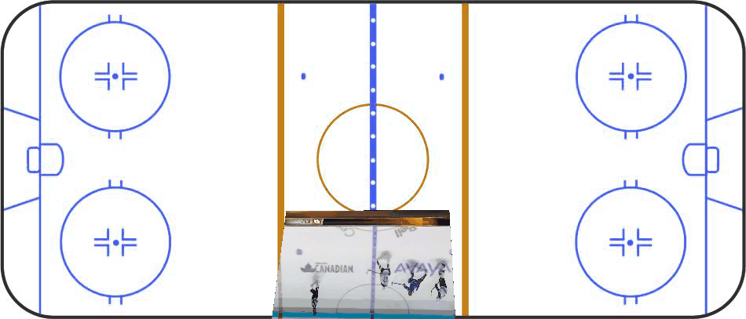

# Video Lab: Object Tracking, Skeleton Tracking, and Homography

An exploration of the field of video analysis and tracking in sports.

---

## Object Detection and Object Tracking

In this section, I used a video of a weightlifter performing a snatch and tracked the weight as it moved from the ground to above the head and back down again.

---

## Skeleton Tracking

In this part of the project, I targeted the major joints of a person running and created a skeleton-tracking overlay.

---

## Homography

homography is a projective transformation between two planes that can be represented by a 3×3 matrix, allowing you to map points from an image (camera view) to a known reference plane (e.g., a court or field) and vice versa.

In this example, a homography was used to align the camera view of a hockey rink to a top-down plane, enabling accurate positional mapping.

